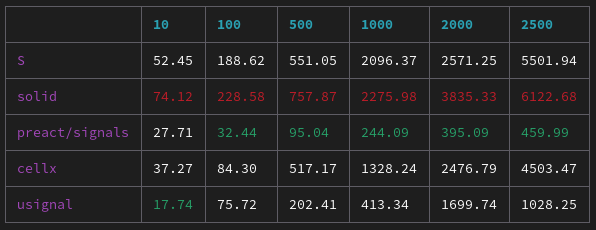

# <em>µ</em>signal

[](https://www.npmjs.com/package/usignal) [](https://coveralls.io/github/WebReflection/usignal?branch=main) [](https://github.com/WebReflection/usignal/actions)

<sup>**Social Media Photo by [Carlos Alberto Gómez Iñiguez](https://unsplash.com/@iniguez) on [Unsplash](https://unsplash.com/)**</sup>

A blend of [@preact/signals-core](https://github.com/preactjs/signals) and [solid-js basic reactivity API](https://www.solidjs.com/docs/latest), with API and DX mostly identical to *@preact/signals-core* but extra goodness inspired by *solid-js*, 789 bytes minified with brotli.

```js
import {signal, computed, effect, batch, Signal} from 'usignal';
// const {signal, computed, effect, batch, Signal} = require('usignal');

signal(0) instanceof Signal;          // true
computed(() => {}) instanceof Signal; // true

effect(
  () => { console.log('fx') },
  void 0,       // optional value to pass along the callback as initial/prev value
  {async: true} // optionally make the effect async: false by default
);

// try every example shown in
// https://github.com/preactjs/signals
// or see test/index.js file to see it in action
```

#### Exports

This is a *dual module* so it works in either *CommonJS* or *ECMAScript* module systems.

  * `usignal/sync` exports with an enforced *sync* effect
  * `usignal/async` exports with an enforced *async* effect
  * `usignal` in *browsers* exports `usignal/async` and `usignal/sync` in *servers* or by *default*
  * `usignal/core` just exports the *effect* as callback that accepts an effect and an optionally asynchronous `true` flag, used by all other exports by default, but you decide if a specific effect should sync or async.
  * the [unpkg/usignal](https://unpkg.com/usignal) default export points at the pre minified [es.js](./es.js) file without any enforcement around *effect*, like `usignal/core`, so that all effects are *sync* by default but can be *async* passing `true` as second parameter

Current exports are exactly these:

```js
import {
  signal,
  computed,
  effect,
  batch,
  Signal
} from 'usignal';
```

The `Signal` export is useful only as brand check for either *computed* or *signal* references, but it cannot be used as constructor right away.


#### Exports - Extra

To allow developers to tray and use different patterns there are a few variants of this module, still based on the very same core primitives:

  * `usignal/fn`, with its `*/sync` and `*/async` variants, where signals are callbacks so that `signal()` returns a its value, and `signal(value)` updates its value and return the new one, [inspired by S](https://github.com/adamhaile/S). Comouteds do not update anything so `computed()` returns values. This is a variant around the `.value` accessor pattern I don't necessarily disike, specially when we'd like to *signal* that a signal is being observed: `effect(() => { mySignal(); })`
  * `usignal/solid`, with its `*/sync` and `*/async` variants, where the module exports [createEffect](https://www.solidjs.com/docs/latest#createeffect), [createMemo](https://www.solidjs.com/docs/latest#creatememo), and [createSignal](https://www.solidjs.com/docs/latest#createsignal), mimicking the behavior (and returned values) as [solid-js basic reactivity API](https://www.solidjs.com/docs/latest/api). This is handy to compare the two or drop-in usignal in solid-js already based code.

---

## Differently thought ...

  * the default comparison for equality is not based on `===` but on [Object.is](https://developer.mozilla.org/en-US/docs/Web/JavaScript/Reference/Global_Objects/Object/is). This might be a tiny, hopefully irrelevant, performance penalty, but I feel like guarding *NaN* cases in reactivity is a step forward to avoid infinite loops out of *NaN* poisoning some computation. *+0* and *-0* are less interesting cases to tackle, still these might be fundamental in some case, hence preserved in this moudle.

  * this library has lazy, non side-effecting, computed values, something [@preact/signals-core](https://github.com/preactjs/signals) recently introduced and [Solid 2.0 is planning to improve](https://twitter.com/RyanCarniato/status/1569815024964706304).

  * computed accepts an initial value otherwise passed as previous one by default, mimicking *solid-js* `useMemo(fn[, value[, options]])` signature.

  * effect passes along its initial value or the previoulsy returned one. If this is a function though, it runs it before re-executing, passing along its returned value, if any.

  * both `signal(value[, options])` and `computed(fn[, value[, options]])` accept an optionally *options* argument, currently implementing [equals](https://www.solidjs.com/docs/latest#options) as explained in *silid-js* documentation.

  * both *signal* and *computed* also return a *thenable* instance that can be used to `await signal` or `await computed` without needing to use `await signal.value` or `await computed.value` out of [this poll](https://twitter.com/WebReflection/status/1571400086902476801).

  * both *signal* and *computed* also have a `toJSON` helper abd a `valueOf()` able to implicitly use their values, e.g.

```js
const one = signal(1);
const two = signal(2);
const three = computed(() => one + two);

three.value;  // 3 indeed!
```

---


## Benchmark

The benchmark currently compares *S*, *solid*, *preact/signals*, and *cellx* against *usignal*.

Please note *preact* is currently not able to solve nested effects so its logic might be simpler than other libraries.

```sh
npm run benchmark
```




## Tests

This module is 100% code covered, including ~~the *WeakRef*~~ possible leaks which is tested through the [test/leak.js](./test/leak.js) file, which is part of the *build* script process.

To use other libraries as reference, I have also added *preact/signals-core* and *solid-js* dev-dependencies within the test folder.

Please note *preact* is currently not able to solve nested effects so its logic might be simpler than other libraries.

The following instructions are needed to test other libraries too:

```sh
cd usignal
npm i
cd test
npm i
cd ..

# normal tests
npm test usignal      # shows also code-coverage
npm test solid
npm test preact

# leak test
npm run leak usignal  # calculate leaks via internals
npm run leak solid
npm run leak preact
```

#### About the leak test

This file is not meant at all as meaningful benchmark against other libraries, it's simply there to allow me to spot regressions on future updates of the library:
  * ~~there should be zero leaks on signals when a computed reference is garbage collected~~ v0.5.0 removed the *WeakRef*, computeds go when signals go ... [but why?!](https://twitter.com/WebReflection/status/1570380914613694466)
  * the amount of used memory should always be lower than the initial one
  * the performance should be competitive compared to others

## How to integrate with Lit

You create a following [mixin](https://lit.dev/docs/composition/mixins/) function. Your class inherits from Mixin. Please see the [demo](https://lit.dev/playground/#project=W3sibmFtZSI6InNpZ25hbC1leGFtcGxlLmpzIiwiY29udGVudCI6ImltcG9ydCB7IGh0bWwsIGNzcywgTGl0RWxlbWVudCB9IGZyb20gJ2xpdCc7XG5pbXBvcnQgeyBXaXRoVXNpZ25hbCB9IGZyb20gJy4vd2l0aC11c2lnbmFsLmpzJztcbmltcG9ydCB7IHNpZ25hbCB9IGZyb20gJ3VzaWduYWwnO1xuXG5jb25zdCBjb3VudGVyID0gc2lnbmFsKDEpO1xuXG5jbGFzcyBTaWduYWxFeGFtcGxlIGV4dGVuZHMgV2l0aFVzaWduYWwoTGl0RWxlbWVudCkge1xuICBzdGF0aWMgc3R5bGVzID0gY3NzYFxuICAgIDpob3N0IHtcbiAgICAgIGRpc3BsYXk6IGJsb2NrO1xuICAgICAgYm9yZGVyOiBzb2xpZCAxcHggYmx1ZTtcbiAgICAgIHBhZGRpbmc6IDhweDtcbiAgICAgIG1hcmdpbjogNHB4O1xuICAgIH1cbiAgYDtcblxuICBzdGF0aWMgcHJvcGVydGllcyA9IHtcbiAgICBjb3VudDogeyBzdGF0ZTogdHJ1ZSB9LFxuICAgIG5hbWU6IHt9XG4gIH1cblxuICBjb25zdHJ1Y3RvcigpIHtcbiAgICBzdXBlcigpO1xuICAgIHRoaXMuY291bnQgPSAxO1xuICB9XG5cbiAgcmVuZGVyKCkge1xuICAgIHJldHVybiBodG1sYFxuICAgICAgPGg0PiR7dGhpcy5uYW1lfTwvaDQ-XG4gICAgICA8cD5cbiAgICAgICAgU2lnbmFsIGNvdW50ZXI6ICR7Y291bnRlcn1cbiAgICAgICAgPGJ1dHRvbiBAY2xpY2s9JHsoKSA9PiBjb3VudGVyLnZhbHVlKyt9PisrPC9idXR0b24-XG4gICAgICA8L3A-XG4gICAgICA8cD5cbiAgICAgICAgUmVhY3RpdmUgcHJvcGVydHkgY291bnRlcjogJHt0aGlzLmNvdW50fVxuICAgICAgICA8YnV0dG9uIEBjbGljaz0keygpID0-IHRoaXMuY291bnQrK30-Kys8L2J1dHRvbj5cbiAgICAgIDwvcD5cbiAgICBgO1xuICB9XG59XG5cbmN1c3RvbUVsZW1lbnRzLmRlZmluZSgnc2lnbmFsLWV4YW1wbGUnLCBTaWduYWxFeGFtcGxlKTsifSx7Im5hbWUiOiJpbmRleC5odG1sIiwiY29udGVudCI6IjwhRE9DVFlQRSBodG1sPlxuPGh0bWw-XG4gIDxoZWFkPlxuICAgIDxzY3JpcHQgdHlwZT1cIm1vZHVsZVwiIHNyYz1cIi4vc2lnbmFsLWV4YW1wbGUuanNcIj48L3NjcmlwdD5cbiAgICA8c3R5bGU-XG4gICAgICBib2R5IHtcbiAgICAgICAgZm9udC1zaXplOiAxLjI1cmVtO1xuICAgICAgICBmb250LWZhbWlseTogc2Fucy1zZXJpZjtcbiAgICAgIH1cbiAgICA8L3N0eWxlPlxuICA8L2hlYWQ-XG4gIDxib2R5PlxuICAgIDxzaWduYWwtZXhhbXBsZSBuYW1lPVwiSW5zdGFuY2UgMVwiPjwvc2lnbmFsLWV4YW1wbGU-XG4gICAgPHNpZ25hbC1leGFtcGxlIG5hbWU9XCJJbnN0YW5jZSAyXCI-PC9zaWduYWwtZXhhbXBsZT5cbiAgPC9ib2R5PlxuPC9odG1sPiJ9LHsibmFtZSI6InBhY2thZ2UuanNvbiIsImNvbnRlbnQiOiJ7XG4gIFwiZGVwZW5kZW5jaWVzXCI6IHtcbiAgICBcImxpdFwiOiBcIl4yLjAuMFwiLFxuICAgIFwiQGxpdC9yZWFjdGl2ZS1lbGVtZW50XCI6IFwiXjEuMC4wXCIsXG4gICAgXCJsaXQtZWxlbWVudFwiOiBcIl4zLjAuMFwiLFxuICAgIFwibGl0LWh0bWxcIjogXCJeMi4wLjBcIlxuICB9XG59IiwiaGlkZGVuIjp0cnVlfSx7Im5hbWUiOiJ3aXRoLXVzaWduYWwuanMiLCJjb250ZW50IjoiaW1wb3J0IHsgZWZmZWN0IH0gZnJvbSAndXNpZ25hbCc7XG5cbmV4cG9ydCBmdW5jdGlvbiBXaXRoVXNpZ25hbChCYXNlKXtcbiAgcmV0dXJuIGNsYXNzIFdpdGhVc2lnbmFsIGV4dGVuZHMgQmFzZSB7XG4gICAgI2Rpc3Bvc2VFZmZlY3RcbiBcbiAgICBkaXNjb25uZWN0ZWRDYWxsYmFjaygpIHtcbiAgICAgIHRoaXMuI2Rpc3Bvc2VFZmZlY3Q_LigpO1xuICAgIH1cblxuICAgIHBlcmZvcm1VcGRhdGUoKSB7XG4gICAgICBpZiAoIXRoaXMuaXNVcGRhdGVQZW5kaW5nKSB7XG4gICAgICAgIHJldHVybjtcbiAgICAgIH1cblxuICAgICAgaWYgKHRoaXMuI2Rpc3Bvc2VFZmZlY3QpIHtcbiAgICAgICAgc3VwZXIucGVyZm9ybVVwZGF0ZSgpO1xuICAgICAgICByZXR1cm5cbiAgICAgIH1cblxuICAgICAgdGhpcy4jZGlzcG9zZUVmZmVjdCA9IGVmZmVjdCgoKSA9PiB7XG4gICAgICAgIHRoaXMuaXNVcGRhdGVQZW5kaW5nID0gdHJ1ZTtcbiAgICAgICAgc3VwZXIucGVyZm9ybVVwZGF0ZSgpO1xuICAgICAgfSk7XG4gICAgfVxuICB9O1xufSJ9XQ) for details. 

```js
import { effect } from 'usignal';

export function WithUsignal(Base){
  return class WithUsignal extends Base {
    #disposeEffect
 
    disconnectedCallback() {
      this.#disposeEffect?.();
    }

    performUpdate() {
      if (!this.isUpdatePending) {
        return;
      }

      if (this.#disposeEffect) {
        super.performUpdate();
        return
      }

      this.#disposeEffect = effect(() => {
        this.isUpdatePending = true;
        super.performUpdate();
      });
    }
  };
}
```
